# demos

This is hopefully one repo to manage all the demos I've been accumulating or at least a place to dump the new ones. The goal here is just to learn new things and test limits.

## [plotly.js](https://github.com/plotly/plotly.js)
<a href="http://rickyreusser.com/demos/schrodinger-1d/">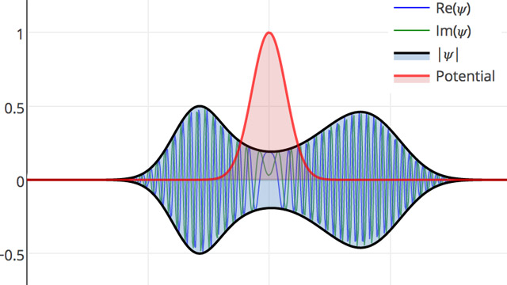</a>
<a href="http://rickyreusser.com/demos/plots/tsucs2.html">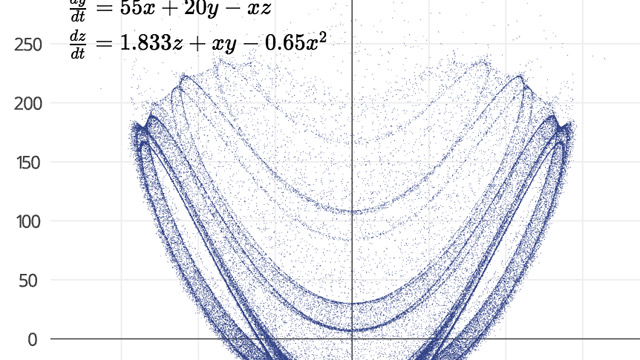</a>
<a href="http://codepen.io/rsreusser/pen/GjZwYb">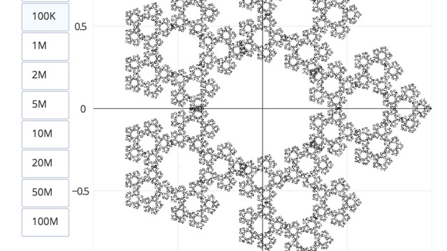</a>

<a href="http://rickyreusser.com/demos/plots/tinkerbell.html">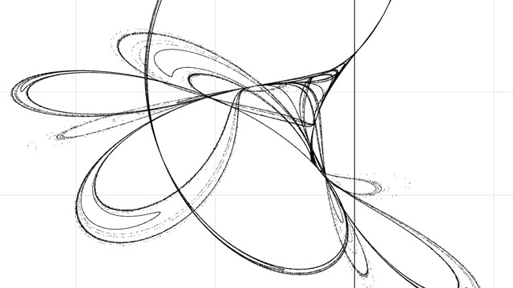</a>
<a href="http://rickyreusser.com/kmpp/">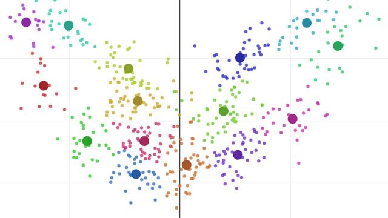</a>

## [regl](https://github.com/regl-project/regl)
<a href="http://rickyreusser.com/demos/regl-sketches/007">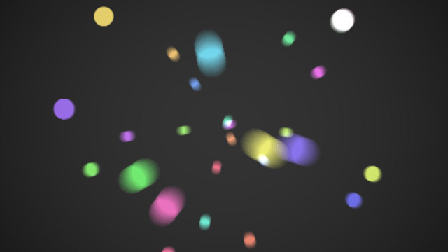</a>
<a href="http://rickyreusser.com/demos/regl-sketches/006">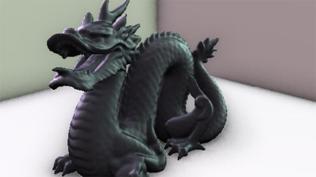</a>
<a href="http://rickyreusser.com/demos/regl-sketches/005">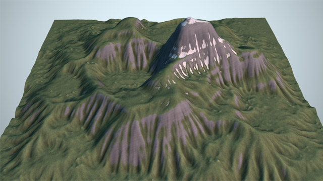</a>
<a href="http://rickyreusser.com/demos/regl-sketches/004">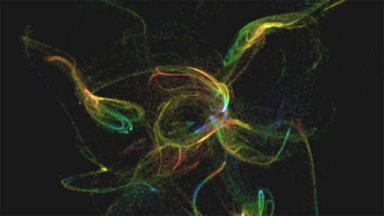</a>
<a href="http://rickyreusser.com/demos/regl-sketches/003">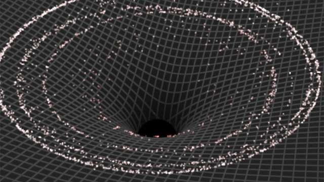</a>
<a href="http://rickyreusser.com/demos/regl-sketches/002">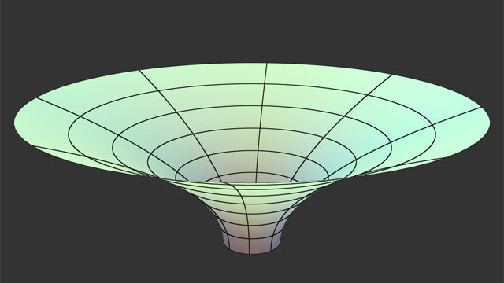</a>
<a href="http://rickyreusser.com/demos/regl-sketches/001">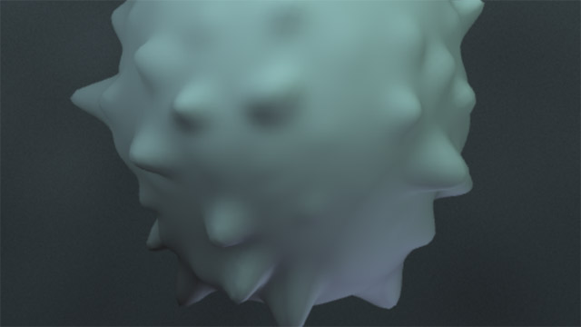</a>
<a href="http://rickyreusser.com/demos/lorenz/">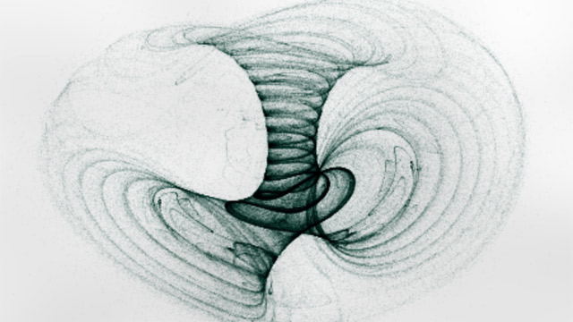</a>
<a href="http://rickyreusser.com/demos/gravity/">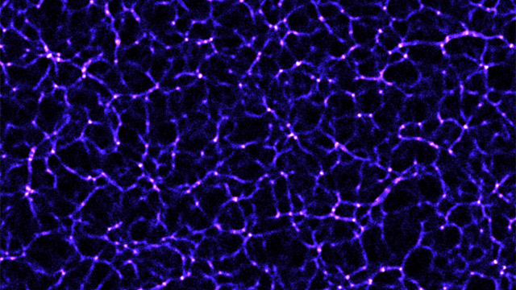</a>
<a href="http://rickyreusser.com/demos/waves/">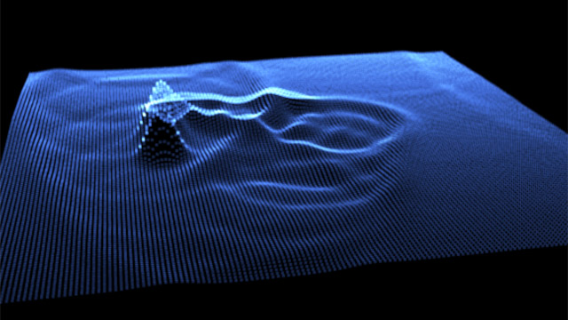</a>
<a href="http://rickyreusser.com/complex-zeros-delves-lyness/lamb.html">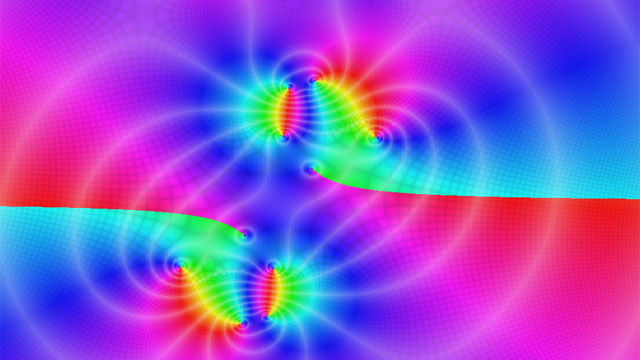</a>
<a href="http://rickyreusser.com/complex-zeros-delves-lyness/zeros.html">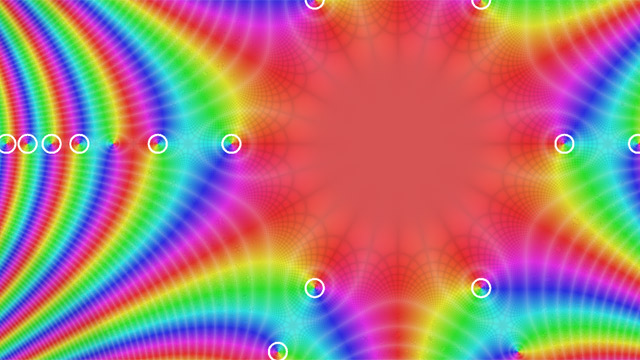</a>
<a href="http://rickyreusser.com/demos/carpet">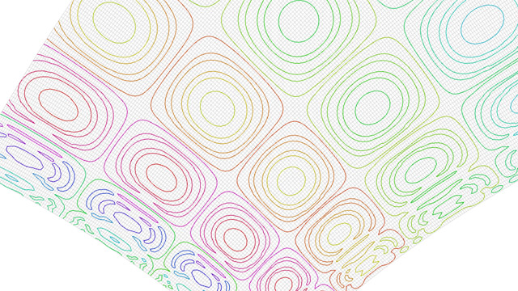</a>
<a href="http://rickyreusser.com/demos/schrodinger/">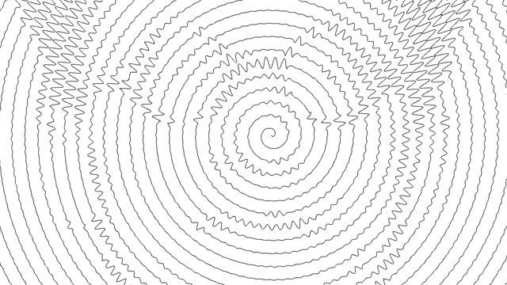</a>
<a href="http://rickyreusser.com/demos/regl-scan/">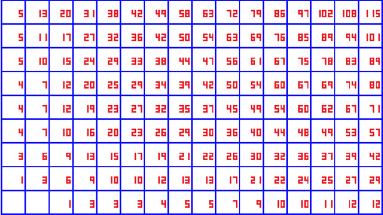</a>
<a href="http://rickyreusser.com/demos/elastodynamics/">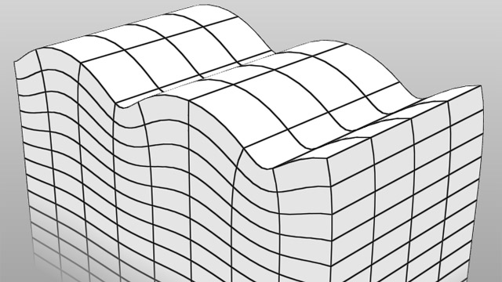</a>
<a href="http://rickyreusser.com/demos/catmull-rom">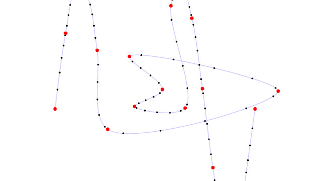</a>
<a href="http://rickyreusser.com/demos/smooth-life/">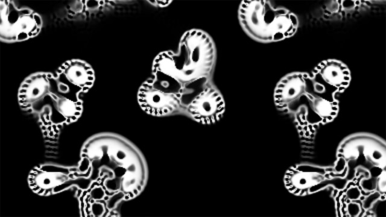</a>
<a href="http://demos.rickyreusser.com/ndarray-transfinite-interpolation/volume.html">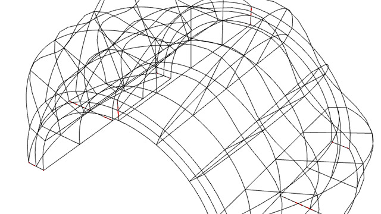</a>

## [d3.js](https://d3js.org/)
<a href="http://rickyreusser.com/demos/brachistochrone/">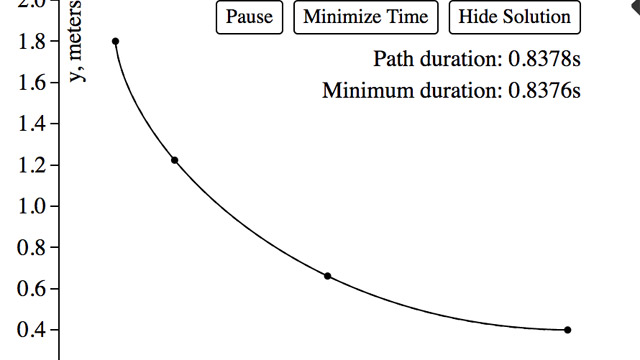</a>
<a href="http://rickyreusser.com/demos/fresnel">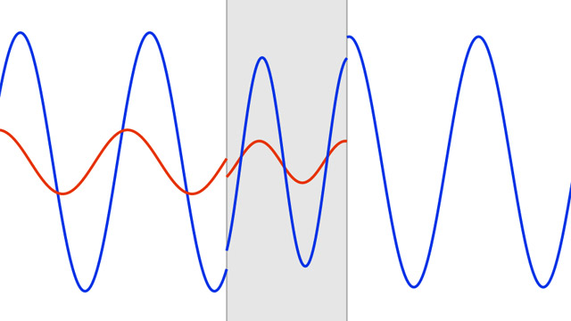</a>
<a href="http://rickyreusser.com/demos/principle-of-least-action/">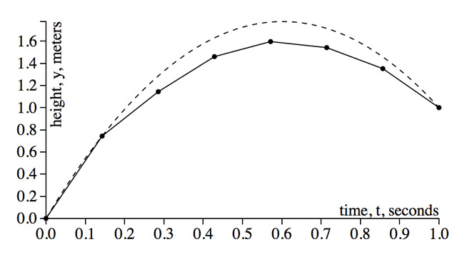</a>
<a href="https://t.d3fc.io/status/742340688562552833">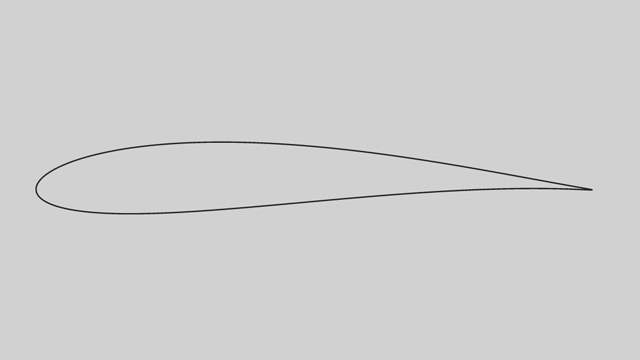</a>

## canvas
<a href="http://rickyreusser.com/demos/double-pendulum/">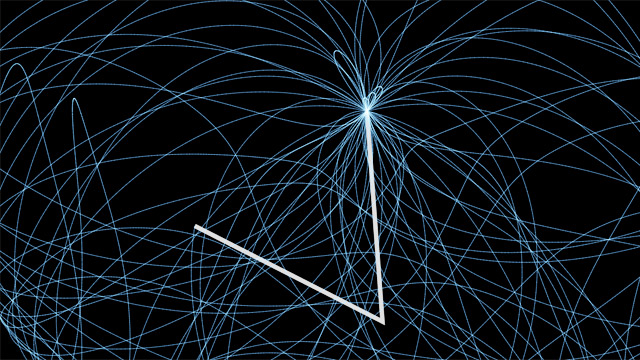</a>

## [three.js](https://threejs.org/)
<a href="http://rickyreusser.com/2016/02/07/hyperbolic-grid-generation/">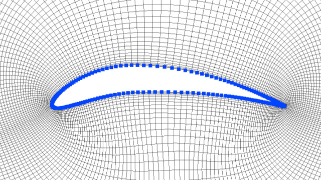</a>

&copy; 2016 Ricky Reusser. MIT License.
