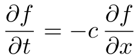
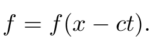
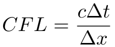

# first-order-wave-equation

> [Simulating the first order wave equation](http://rickyreusser.com/demos/first-order-wave-equation/)

Nothing too interesting here. Just wasting time trying to figure out what it means to carry things all the way through and actually use [scijs](http://scijs.net/packages). So this repo implements a simple simulation of the first-order wave equation,

The equation permits a very simple solution,

That is, any smooth function simply translates ("is advected") to the right. The Courant-Friedrichs-Lewy (CFL) number is defined by

and measures how far the solution moves in a single time step relative to the grid spacing. CFL = 1 indicates the solution moves a full grid step in each time step and defines a baseline limit of stability, though the individual methods differ.

## Demos

The demos below should show a wave traveling uniformly to the right. The extent to which the high-frequency waves move more slowly than the low-frequency waves is error calledd dispersion. The tendency for the high-frequency waves to get damped out is error called dissipation. The most accurate method is RK4 + Spectral.

- [Euler, Upwind, CFL = 0.2](http://rickyreusser.com/demos/first-order-wave-equation/?time=euler&space=upwind&cfl=0.2) (dissipative)
- [Euler, Downwind, CFL = 0.2](http://rickyreusser.com/demos/first-order-wave-equation/?time=euler&space=downwind&cfl=0.2) (unstable)
- [Euler, Second order central, CFL = 0.2](http://rickyreusser.com/demos/first-order-wave-equation/?time=euler&space=central&cfl=0.2) (unstable)
- [Midpoint, Second order central, CFL = 0.2](http://rickyreusser.com/demos/first-order-wave-equation/?time=midpoint&space=central&cfl=0.2) (dispersive)
- [RK4, Sixth-order compact, CFL = 0.2](http://rickyreusser.com/demos/first-order-wave-equation/?time=rk4&space=compact6&cfl=0.2) (stable)
- [RK4, Eigth-order compact, CFL = 0.2](http://rickyreusser.com/demos/first-order-wave-equation/?time=rk4&space=compact8&cfl=0.2) (dissipative)
- [RK4, Spectral, CFL = 0.2](http://rickyreusser.com/demos/first-order-wave-equation/?time=rk4&space=spectral&cfl=0.2) (exact wavenumber resolution)
- [RK4, Spectral, CFL = 0.5](http://rickyreusser.com/demos/first-order-wave-equation/?time=rk4&space=spectral&cfl=0.5) (exact wavenumber resolution; dissipative?)

# Methods

This repo implements solutions using the following methods in time:

- First order [Euler integration](http://scijs.net/packages/#scijs/ode-euler)
- Second order [midpoint integration](http://scijs.net/packages/#scijs/ode-midpoint)
- Fourth order [RK-4 integration](http://scijs.net/packages/#scijs/ode-rk4)

and in space:

- Explicit [first order upwind](./demos/first-order-wave-equation/upwind.js) finite difference
- Explicit [first order downwind](./demos/first-order-wave-equation/downwind.js) finite difference (always unstable)
- Explicit [central second order](./demos/first-order-wave-equation/central.js) finite difference
- Implicit [sixth order compact](./demos/first-order-wave-equation/compact-sixth-order.js) scheme [[1]](#1)
- Implicit [eighth order compact](./demos/first-order-wave-equation/compact-eighth-order.js) scheme [[1]](#1)
- [Spectral](./demos/first-order-wave-equation/spectral.js) (= [FFT](http://scijs.net/packages/#scijs/ndarray-fft)), resolves wavenumber exactly)

As a brief aside, compact schemes are similar to more common explicit finite differences, except they achieve a higher order of accuracy for a smaller stencil by solving for all derivatives simultaneously. The general form is [[1]](#1)

This is a tridiagonal system that can be [solved periodically](http://scijs.net/packages/#scijs/solve-periodic-tridiagonal) to avoid dealing with boundary conditions.

## References
Lele, S. K. (1992). [Compact Finite Difference Schemes with Spectral-like Resolution](http://www.math.colostate.edu/~yzhou/course/math750_fall2009/Lele_1992JCP.pdf). Journal of Computational Physics, 103, 16-42.

# License

&copy; 2016 Ricky Reusser. MIT License.