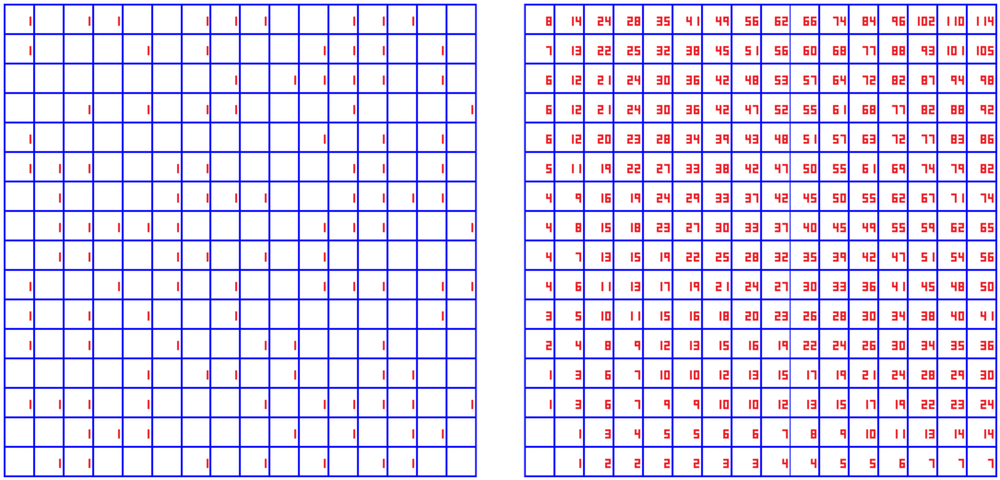

# regl-scan

> GPU Scan (generalized prefix-sum) via regl

## Introduction

Applies a [scan (prefix-sum)](https://en.wikipedia.org/wiki/Prefix_sum) operation to a [regl](https://github.com/regl-project/regl) framebuffer. It's very similar to map-reduce except each output component contains a partial result. This repo implements the basic algorithm in GLSL, subject to the limitation that it only deals in 2D four-component textures of type `uint8` or `float32`.

## Example

<a href="http://rickyreusser.com/demos/regl-scan/"></a>

See: [live demo](http://rickyreusser.com/demos/regl-scan/)

To compute a [summed area table](https://en.wikipedia.org/wiki/Summed_area_table) for each component independently:

```javscript
const prefixSum = require('./)(regl, {
  reduce: `vec4 reduce(vec4 prefix, vec4 sum) {
    return prefix + sum;
  }`
});

var result = prefixSum({src: srcFbo, dest: destFbo, axis: 0});
```

where `srcFbo` and `destFbo` are [regl framebuffers](https://github.com/regl-project/regl).

Or to compute a summed area table for a input vector containing adjacent `xyzw` vectors:

```javscript
const prefixSum = require('./)(regl, {
  map: `vec4 map(vec4 f) {
    // Prefix-sum for this vec4:
    f.yzw += f.xyz;
    f.zw += f.xy;
    return f;
  }
  reduce: `vec4 reduce(vec4 prefix, vec4 sum) {
    // Only care about the *last* component of the prefix:
    return vec4(prefix.w) + sum;
  }`
});

var result = prefixSum({src: srcFbo, dest: destFbo, axis: 0});
```

## See also

- [ndarray-prefix-sum](https://github.com/scijs/ndarray-prefix-sum)

## License

&copy; Ricky Reusser 2016. MIT License.
